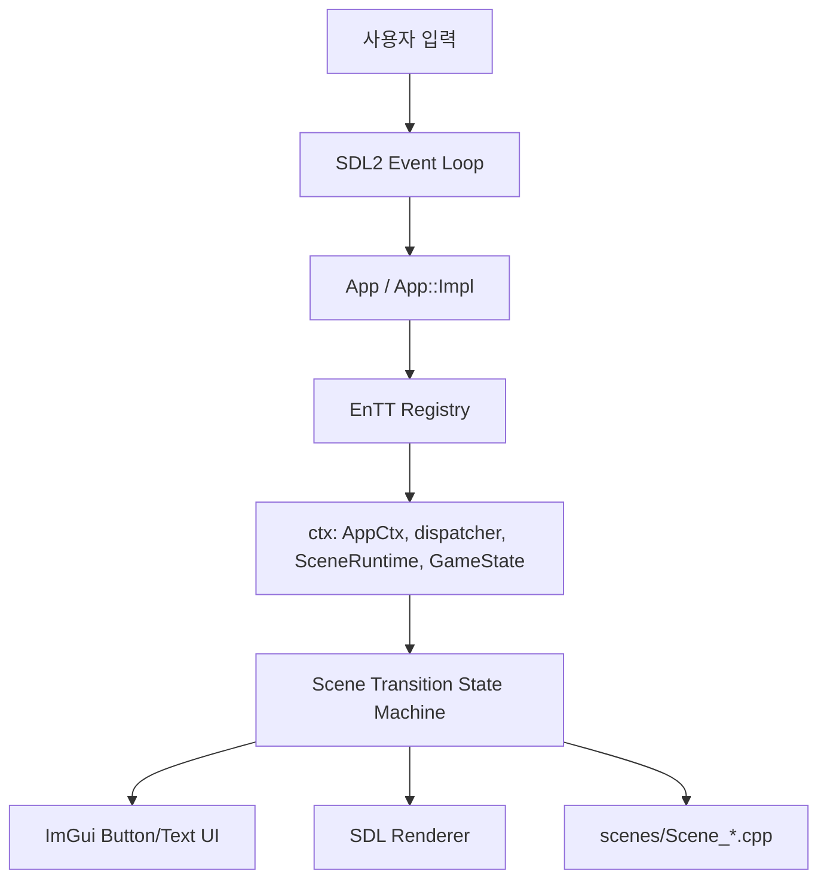
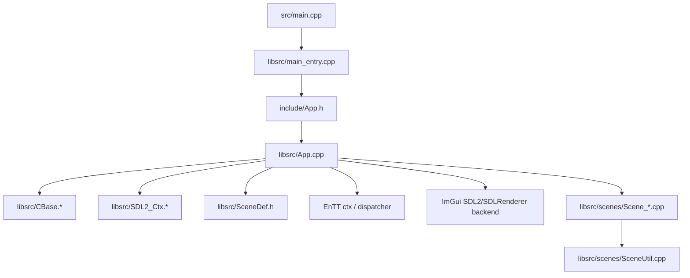
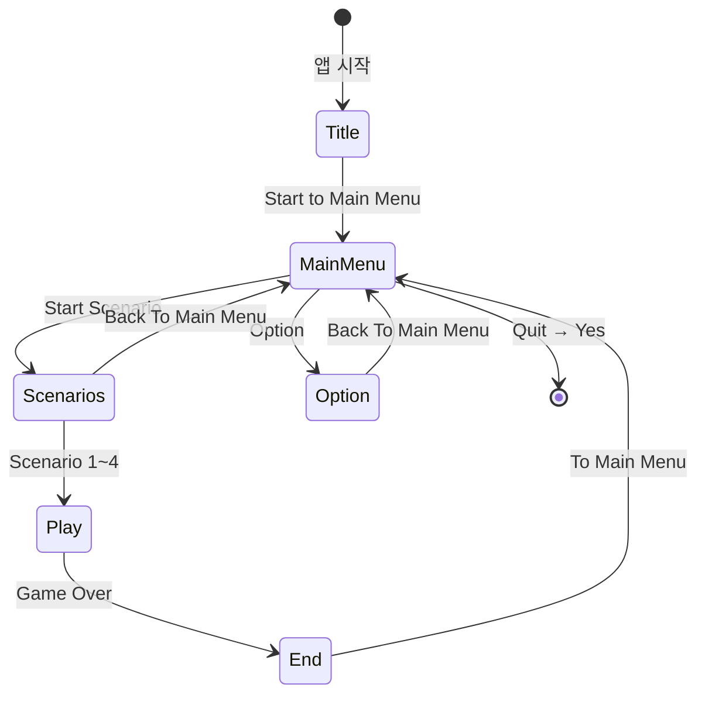
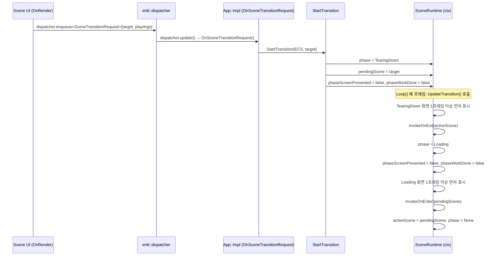
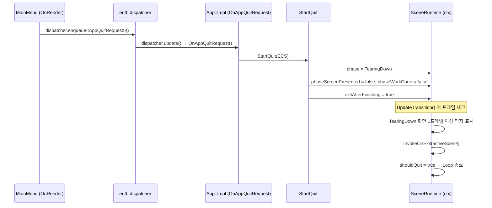

# Architecture Design Document — app_base

## Document Revision

| Version | Date       | Comment                              | Author |
|---------|------------|--------------------------------------|--------|
| 0.1     | 2026-05-13 | Initial architecture draft and build | designer |
| 0.2     | 2026-05-14 | Scene 파일 분리, SceneDef.h 도입, GameState ctx 추가, onUpdate 훅 추가, Play씬 예시 구현 반영 | designer |

---

## 1. Document Descriptions

### 1.1 The Purpose of Document

이 문서는 `/home/ubuntu/00_work/04_wc/tmpl` 프로젝트를 SDL2 + EnTT + ImGui 기반의 scene 중심 앱/게임 시작 템플릿으로 정리하기 위한 소프트웨어 아키텍처를 기술한다. 요구사항 명세서의 기능 요구와 제약을 구현 가능한 구조로 구체화하고, scene lifecycle, 전환 흐름, runtime context 관리 방식, 파일 배치 원칙을 명확히 설명한다.

### 1.2 The Scope of Document

본 문서의 범위는 다음을 포함한다.

- SDL2 윈도우/렌더러 기반 메인 실행 구조
- EnTT `ctx` 기반 공유 runtime context 관리
- EnTT `dispatcher` 기반 scene 전이 이벤트 처리
- ImGui 기반 최소 텍스트/버튼 UI scene 구성
- `Title`, `Main Menu`, `Scenarios`, `Option`, `Play`, `End` 6개 본 scene
- `OnEnter`, `OnExit`, `TearingDown`, `Loading`를 포함한 전이 상태 처리
- Main Menu의 Quit popup 및 종료 전환 흐름
- 기존 `App`, `CBase`, `SDL2_Ctx`, `main_entry` 중심 구조 유지 전략

다음은 범위에 포함되지 않는다.

- 실제 게임 플레이 로직
- scenario별 개별 콘텐츠 차별화
- 외부 yaml/json 기반 scene 설정 파일
- docking, ini 저장 등 editor 지향 ImGui 기능
- 복잡한 ECS entity/component gameplay 설계

### 1.3 The Organization of Document

- 섹션 1: 문서 개요
- 섹션 2: 프로젝트 개요 및 이해관계자
- 섹션 3: 아키텍처 드라이버
- 섹션 4: 시스템 컨텍스트
- 섹션 5: 아키텍처 설계
  - 5.1 Static Perspectives (Module View)
  - 5.2 Runtime Context Design
  - 5.3 Scene Design (State Diagram 포함)
  - 5.4 Play Scene 설계
  - 5.5 Dynamic Perspectives (Scene Transition View)
  - 5.6 Dynamic Perspectives (Boot → Title → Main Menu 콜스택)
  - 5.7 Rendering Policy
  - 5.8 Physical Perspectives (File Structure)
  - 5.9 Key Design Decisions
- 섹션 6: 아키텍처 대안 및 선택 근거
- 섹션 7: 구현 반영 요약

### 1.4 Terminology and Definitions

| 용어 | 정의 |
|------|------|
| Scene | 사용자에게 노출되는 화면 단위. Title, Main Menu, Scenarios, Option, Play, End를 의미 |
| OnEnter | 대상 scene가 활성화되기 직전 실행되는 진입 handler |
| OnExit | 현재 scene를 떠나기 직전 실행되는 종료 handler |
| OnUpdate | 매 프레임 scene 로직을 갱신하는 handler. SceneDefinition의 선택적 훅으로 nullptr이면 스킵 |
| Transition Phase | `TearingDown`, `Loading`처럼 본 scene 사이에 표시되는 전환 상태 |
| AppCtx | SDL window, renderer, font, sound 등 SDL runtime 자원을 저장하는 EnTT ctx 객체 |
| SceneRuntime | 현재 scene, pending scene, 전환 단계, playArgs 등 앱 흐름 상태를 저장하는 EnTT ctx 객체 |
| PlayArgs | Scenarios 씬에서 Play 씬으로 전달하는 인자 구조체. `selectedScenario` 필드 포함. `SceneTransitionRequest`의 `std::optional<PlayArgs>`로 전달 |
| GameState | 씬 간 공유되는 앱 전역 누적 상태(playerName, level, score, gold, playTimeSec)를 저장하는 EnTT ctx 객체 |
| SceneDef.h | SceneId, TransitionPhase, PlayArgs, SceneTransitionRequest, AppQuitRequest, SceneRuntime, GameState를 정의하는 공유 헤더. SDL/EnTT 의존성 없음 |
| Dispatcher Event | scene 전이 요청, 종료 요청을 전달하는 EnTT dispatcher 이벤트 |

---

## 2. Project Overview

`app_base`는 완성 게임이 아니라 SDL2 기반 애플리케이션이나 게임의 시작점으로 재사용할 수 있는 템플릿이다. 기존 프로젝트 골격을 최대한 보존하면서, 메인 루프와 scene lifecycle, 화면 전이, Quit popup, ctx/dispatcher 기반 상태 관리 구조를 실제로 동작하는 수준으로 제공하는 것이 목표다.

### 2.1 The Stakeholders

| 이해관계자 | 역할 | 관심사 |
|------------|------|--------|
| 템플릿 사용자 개발자 | 새 SDL 앱/게임의 출발점 활용 | scene 전이 구조의 이해 용이성, 즉시 실행 가능성 |
| 유지보수 개발자 | 템플릿 구조 확장 | 기존 구조 유지, 최소 침습 수정, 문서-코드 정합성 |
| QA/검증 담당자 | 빌드 및 실행 검증 | 전이 순서 준수, popup 동작, 빌드 가능 상태 유지 |

---

## 3. Architectural Drivers

### 3.1 Constraints

#### 3.1.1 Business Constraints

| ID | 설명 |
|----|------|
| BC-01 | 본 프로젝트는 완성 게임이 아닌 재사용 가능한 SDL 앱/게임 시작 템플릿이어야 한다. |
| BC-02 | 기존 `include/App.h`, `libsrc/App.cpp`, `libsrc/CBase.*`, `libsrc/SDL2_Ctx.*`, `src/main.cpp`, `libsrc/main_entry.*` 중심 구조를 최대한 유지한다. |
| BC-03 | scene 전이 규칙은 외부 설정 파일이 아니라 내부 코드에 명시한다. |

#### 3.1.2 Technical Constraints

| ID | 설명 |
|----|------|
| TC-01 | SDL2 기반 윈도우/렌더러 생성과 이벤트 루프를 사용한다. |
| TC-02 | 공유 runtime 객체는 EnTT `registry::ctx`에 저장한다. |
| TC-03 | scene 전이 요청은 EnTT `dispatcher` 이벤트로 처리한다. |
| TC-04 | ImGui는 최소 버튼/텍스트 UI 용도로만 사용하고 ini 저장은 비활성화한다. |
| TC-05 | 기존 윈도우 기본값(1024x768 등)은 유지한다. |

### 3.2 Functional Requirements Mapping

| REQ ID | 설명 | 아키텍처 반영 |
|--------|------|---------------|
| FR-001 ~ FR-002 | SDL 실행 및 ctx 저장 | `App::Impl`에서 `AppCtx`를 emplace하고 SDL/ImGui를 초기화 |
| FR-003 | dispatcher 기반 scene 전이 | `SceneTransitionRequest`, `AppQuitRequest` 이벤트 정의 및 구독 |
| FR-004 ~ FR-011 | 6개 scene 및 버튼 흐름 | `SceneId` enum과 scene 렌더 함수, 내부 코드 기반 전이 정의 |
| FR-012 ~ FR-013 | OnEnter/OnExit와 phase 내부 전환 작업 | `SceneRuntime.phase`, `phaseStartTicks`, `phaseScreenPresented`, `phaseWorkDone`, pendingScene 기반 상태 머신 |
| FR-014 ~ FR-015 | Quit popup 및 종료 흐름 | Main Menu popup + `AppQuitRequest` -> `TearingDown` 후 종료 |
| FR-016 ~ FR-017 | 배경색 정책 | scene: 회색, transition: 옅은 녹색으로 SDL clear color 분기 |
| FR-018 ~ FR-019 | ImGui 최소 UI, 기존 창 기본값 유지 | 간단한 버튼/텍스트만 사용, `SDL2_Ctx.h` 상수 유지 |

### 3.3 Quality Attributes

| ID | 품질 속성 | 설명 |
|----|-----------|------|
| QA-01 | 이해 용이성 | scene 식별, 요청 이벤트, lifecycle, 전환 상태가 한 파일 흐름으로 추적 가능해야 한다. |
| QA-02 | 최소 침습 수정 | 기존 App/CBase/SDL2_Ctx 구조를 유지하고 핵심 로직을 `App.cpp` 중심으로 수용한다. |
| QA-03 | 재사용성 | 새 프로젝트가 scene/버튼만 바꾸어도 출발점으로 사용할 수 있어야 한다. |
| QA-04 | 빌드 가능성 | 문서화 이후 실제 빌드 가능한 상태를 유지해야 한다. |

### 3.4 Assumptions

| ID | 가정 | 근거 |
|----|------|------|
| AS-01 | 최초 부팅 시 별도 `Loading` 없이 `Title` scene으로 즉시 진입한다. | requirements.md의 확인 필요 항목 C-001에 대한 합리적 기본값 |
| AS-02 | `Scenario 1~4` 선택값은 `PlayArgs.selectedScenario`에 저장하고 `SceneTransitionRequest`의 `std::optional<PlayArgs>`로 Play scene에 전달한다. Play scene HUD에 텍스트로 표시한다. | requirements.md의 확인 필요 항목 C-002에 대한 합리적 기본값 |

---

## 4. System Context

[그림 4-1]



[표 4-1]

| Entity | 책임 |
|--------|------|
| User | 버튼 클릭 및 윈도우 종료 입력 제공 |
| SDL2 | 윈도우, 렌더러, 이벤트 큐, 프레임 표시 제공 |
| App / App::Impl | 앱 전체 생명주기, scene 루프, transition 상태 관리 |
| EnTT Registry | 공유 컨텍스트 보관소 역할 |
| AppCtx | SDL runtime 자원 저장 |
| SceneRuntime | scene 상태, 전환 단계, playArgs 저장 |
| GameState | 씬 간 누적 전역 상태(playerName, level, score, gold, playTimeSec) 저장 |
| Dispatcher | scene 전이와 종료 요청 이벤트 전달 |
| ImGui | 최소 버튼/텍스트 UI 표시 |
| scenes/Scene_*.cpp | 씬별 OnEnter/OnExit/OnRender/OnUpdate 구현 파일 |

[표 4-2]

| 관계 | 방향 | 설명 |
|------|------|------|
| User → SDL2 | 입력 | SDL 이벤트 큐로 사용자 입력 수신 |
| SDL2 → App | 이벤트 전달 | App 루프가 SDL 이벤트를 polling |
| App → Dispatcher | 요청 발행/처리 | 버튼 클릭을 전이 이벤트로 enqueue/update |
| App → SceneRuntime | 상태 변경 | 전환 단계, pending scene, 종료 여부 기록 |
| App → SDL Renderer | 렌더링 | 배경색 clear 후 ImGui draw 결과 표시 |

---

## 5. Architecture Design

### 5.1 Static Perspectives (Module View)

[그림 5-1]



[표 5-1]

| Module | 책임 |
|--------|------|
| `src/main.cpp` | glog 초기화 후 `main_entry()` 호출 |
| `libsrc/main_entry.cpp` | `App` 실행 시작 및 종료 대기 |
| `include/App.h` | `App` 외부 인터페이스 제공 (`Start`, `Wait`, `Stop`) |
| `libsrc/App.cpp` | dispatcher 연결, lifecycle, 전환 상태 머신, 렌더 루프 구현 |
| `libsrc/CBase.h/.cpp` | 스레드 기반 pre/loop/post 실행 엔진 및 루프 종료/대기 제어 |
| `libsrc/SDL2_Ctx.h/.cpp` | SDL window/renderer/font/sound 초기화 및 해제 |
| `libsrc/SceneDef.h` | TransitionPhase, PlayArgs, SceneTransitionRequest, AppQuitRequest, SceneRuntime, GameState 공유 타입 정의. scenes/SceneMap.h 를 include |
| `libsrc/scenes/SceneUtil.h/.cpp` | BeginFullscreenUi 등 씬 공통 유틸 함수 |
| `libsrc/scenes/SceneMap.h/.cpp` | SceneId, SceneHook, SceneDefinition, GetSceneMap(). 새 씬 추가 시 이 파일만 수정 |
| `libsrc/scenes/Scene_Title.h/.cpp` | Title 씬 OnEnter/OnExit/OnRender |
| `libsrc/scenes/Scene_MainMenu.h/.cpp` | Main Menu 씬 OnEnter/OnExit/OnRender |
| `libsrc/scenes/Scene_Scenarios.h/.cpp` | Scenarios 씬 OnEnter/OnExit/OnRender |
| `libsrc/scenes/Scene_Option.h/.cpp` | Option 씬 OnEnter/OnExit/OnRender |
| `libsrc/scenes/Scene_Play.h/.cpp` | Play 씬 OnEnter/OnExit/OnRender/OnUpdate + ECS/GameState 사용 예시 |
| `libsrc/scenes/Scene_End.h/.cpp` | End 씬 OnEnter/OnExit/OnRender |

### 5.2 Runtime Context Design

[표 5-2]

| ctx 객체 | 저장 위치 | 내용 | 사용 주체 |
|----------|-----------|------|-----------| 
| `AppCtx` | `registry.ctx()` | SDL_Window, SDL_Renderer, TTF_Font, sound, joystick | SDL 초기화/렌더링/정리 |
| `entt::dispatcher` | `registry.ctx()` | scene 전이 요청, 앱 종료 요청 event bus | UI 입력, scene manager |
| `SceneRuntime` | `registry.ctx()` | activeScene, pendingScene, phase, ticks, quit flag, playArgs, lifecycle note | scene manager, renderer |
| `GameState` | `registry.ctx()` | playerName, level, score, gold, playTimeSec — 씬 간 공유 누적 상태 | 모든 씬에서 접근 가능 |
`App::Impl` 생성자에서 `AppCtx`, `dispatcher`, `SceneRuntime`, `GameState`를 emplace한다. scene와 루프 코드는 전역 변수 없이 `ctx`와 ECS 컴포넌트를 통해 공유 상태에 접근한다.

### 5.3 Scene Design

[표 5-3]

| Scene | 주요 UI | 전이 |
|-------|---------|------|
| Title | `Title`, `Start to Main Menu` | Main Menu |
| Main Menu | `Start Scenario`, `Option`, `Quit` | Scenarios, Option, Quit popup |
| Scenarios | `Scenario 1~4`, `Back To Main Menu` | Play, Main Menu |
| Option | `Back To Main Menu` | Main Menu |
| Play | `Selected Scenario`, `Game Over` | End |
| End | `To Main Menu` | Main Menu |

각 scene는 다음 훅 집합으로 구성한다.

- `onEnter` — 씬 진입 직전 호출 (필수)
- `onExit` — 씬 이탈 직전 호출 (필수)
- `onRender` — 매 프레임 렌더링 호출 (필수)
- `onUpdate` — 매 프레임 로직 갱신 호출 (선택적, nullptr이면 스킵, 전이 중에도 스킵)

구현은 별도 yaml/json 없이 `libsrc/scenes/SceneMap.cpp`의 `GetSceneMap()` 함수가 `SceneId -> SceneDefinition` 맵을 반환한다. 각 씬의 훅 함수는 `libsrc/scenes/Scene_*.cpp`에 분리 구현하고 `SceneMap.cpp`에서 함수 포인터로 등록한다. `App.cpp`의 `SetupSceneMap()`은 `m_sceneMap = GetSceneMap()` 한 줄로 위임한다.

[그림 5-1] Scene State Diagram



### 5.4 Play Scene 설계

Play 씬은 단순 placeholder가 아니라 템플릿 사용자를 위한 예시 구현을 포함한다.

- 상단 1/3: ImGui HUD (선택된 시나리오, 씬 내 점수, 전역 상태 표시)
- 하단 2/3: SDL Renderer 게임 드로잉 영역 (삼각형/원/사각형 애니메이션)
- Play 씬 전용 entity/component: 씬 내 일시 상태 (회전, 반지름, 점수 등)
- `GameState` ctx: 씬 간 누적 상태 (score, playTimeSec 등) — Play 씬 OnUpdate에서 누적
- `onUpdate`에서 삼각형 회전, 원 맥박, 점수 증가, GameState 누적을 처리한다.

### 5.5 Dynamic Perspectives (Scene Transition View)

[그림 5-2] 일반 scene 전환 흐름 (dispatcher 이벤트 → 상태 머신)



[그림 5-3] Quit 흐름



[표 5-4]

| 상태 | 설명 | 배경색 |
|------|------|--------|
| `None` | 활성 본 scene 표시 상태 | 회색 |
| `TearingDown` | 전환 화면을 먼저 보여준 뒤 현재 scene OnExit를 수행하는 단계 | 옅은 녹색 |
| `Loading` | 전환 화면을 먼저 보여준 뒤 대상 scene OnEnter를 수행하는 단계 | 옅은 녹색 |

### 5.6 Dynamic Perspectives (Boot → Title → Main Menu 콜스택)

독자가 코드를 처음 읽을 때 "어디서 어떤 함수가 호출되는가"를 따라갈 수 있도록 부팅부터 Title → Main Menu 전환까지 실제 함수 콜스택을 기준으로 기술한다.

#### 부팅 ~ Title 진입

```
main()
└── main_entry()
    └── App::Start()
        └── CBase::Start()   // 스레드 생성 후 루프 진입
            └── PreLoop(ECS)
                ├── SDL2_Ctx::Init()        // SDL window/renderer/font 초기화
                ├── InitImGui()             // ImGui 백엔드 초기화
                ├── SetupSceneMap()         // SceneId → SceneDefinition 함수 포인터 등록
                ├── SetupProcedureMap()     // PreLoop/Loop/PostLoop 등록
                └── InvokeOnEnter(ECS, SceneId::Title)
                    └── Scene::Title::OnEnter(ECS)   // Title 씬 진입
```

#### 메인 루프 (매 프레임)

```
Loop(ECS)                                  // CBase 루프에서 매 프레임 호출
├── ProcessSdlEvents(ECS)                  // SDL 이벤트 polling, 윈도우 닫기 처리
├── dispatcher.update<SceneTransitionRequest>()   // 대기 중인 전이 요청 처리
├── dispatcher.update<AppQuitRequest>()           // 대기 중인 종료 요청 처리
├── UpdateTransition(ECS)                  // phase 상태 머신 갱신
├── UpdateActiveScene(ECS)                 // phase == None 일 때만 onUpdate 호출
└── Render(ECS)
    ├── ImGui_ImplSDLRenderer_NewFrame() / ImGui_ImplSDL2_NewFrame() / ImGui::NewFrame()
    ├── SDL_SetRenderDrawColor() / SDL_RenderClear()    // 배경색 칠하기
    ├── phase == None  → RenderActiveScene(ECS)         // 씬 onRender 호출
    │   └── sceneMap[activeScene].onRender(ECS)
    │       └── Scene::Title::OnRender(ECS)             // ImGui 버튼/텍스트 표시
    ├── phase != None  → RenderTransitionScreen()       // TearingDown / Loading 화면
    ├── ImGui::Render()
    ├── ImGui_ImplSDLRenderer_RenderDrawData()
    └── SDL_RenderPresent()
```

#### Title → Main Menu 전환 (버튼 클릭 시)

```
Scene::Title::OnRender(ECS)
└── ImGui::Button("Start to Main Menu") 클릭
    └── dispatcher.enqueue<SceneTransitionRequest>{ target=MainMenu }
        ※ 아직 큐에만 적재, 이번 프레임에서는 처리 안 됨

다음 프레임 Loop(ECS)
└── dispatcher.update<SceneTransitionRequest>()
    └── App::Impl::OnSceneTransitionRequest(request)
        └── StartTransition(ECS, SceneId::MainMenu)
            ├── runtime.phase = TearingDown
            ├── runtime.pendingScene = MainMenu
            ├── runtime.phaseScreenPresented = false
            └── runtime.phaseWorkDone = false

이후 프레임들: UpdateTransition(ECS) 매 프레임 체크
└── TearingDown 화면을 먼저 1프레임 이상 표시
    ├── InvokeOnExit(ECS, SceneId::Title)
    │   └── Scene::Title::OnExit(ECS)
    ├── runtime.phaseWorkDone = true
    ├── runtime.phase = Loading
    ├── Loading 화면을 먼저 1프레임 이상 표시
    ├── InvokeOnEnter(ECS, SceneId::MainMenu)
    │   └── Scene::MainMenu::OnEnter(ECS)
    └── runtime.activeScene = MainMenu, runtime.phase = None
        → 이후 프레임부터 Scene::MainMenu::OnRender 호출
```

### 5.7 Rendering Policy

[표 5-5]

| 화면 종류 | SDL Clear Color | UI 내용 |
|-----------|-----------------|---------|
| 본 scene | 회색 계열 `(110,110,110)` | scene 제목, 설명, 버튼, lifecycle 정보 |
| 전환 화면 | 옅은 녹색 계열 `(210,235,210)` | `TearingDown` 또는 `Loading`, 현재/대상 scene 정보 |
| Quit popup | ImGui modal | `Yes`, `No` 버튼 |

배경색은 SDL renderer의 clear color로 먼저 칠하고, 그 위에 ImGui window를 투명 배경으로 얹는 방식으로 처리한다. 이렇게 하면 scene/transition 색상 정책을 명확하게 분리할 수 있다.

### 5.8 Physical Perspectives (File Structure)

```text
/home/ubuntu/00_work/04_wc/tmpl
├── 3rdparty/
│   ├── entt/
│   └── imgui/
├── include/
│   └── App.h
├── libsrc/
│   ├── App.cpp
│   ├── CBase.cpp
│   ├── CBase.h
│   ├── SDL2_Ctx.cpp
│   ├── SDL2_Ctx.h
│   ├── SceneDef.h
│   ├── main_entry.cpp
│   ├── main_entry.h
│   └── scenes/
│       ├── SceneUtil.h
│       ├── SceneUtil.cpp
│       ├── SceneMap.h
│       ├── SceneMap.cpp
│       ├── Scene_Title.h
│       ├── Scene_Title.cpp
│       ├── Scene_MainMenu.h
│       ├── Scene_MainMenu.cpp
│       ├── Scene_Scenarios.h
│       ├── Scene_Scenarios.cpp
│       ├── Scene_Option.h
│       ├── Scene_Option.cpp
│       ├── Scene_Play.h
│       ├── Scene_Play.cpp
│       ├── Scene_End.h
│       └── Scene_End.cpp
├── src/
│   └── main.cpp
└── docs/
    ├── requirements.md
    ├── architecture.md
    ├── test_strategy.md
    └── interview_log.md
```

### 5.9 Key Design Decisions

[표 5-6]

| 결정 | 선택안 | 이유 |
|------|--------|------|
| Scene 정의 위치 | `scenes/SceneMap.cpp` — GetSceneMap() 팩토리 | App.cpp로부터 씬 목록 분리. 새 씬 추가 시 App.cpp 무수정 |
| Scene 구현 파일 분리 | `libsrc/scenes/Scene_*.cpp` | 씬별 파일 분리로 확장성 확보. 파일명이 C++ 네임스페이스(`Scene::Title` 등)를 반영 |
| SceneUtil 파일명 | `SceneUtil.h/.cpp` (prefix 없음) | 특정 씬 네임스페이스가 아닌 공통 유틸이므로 Scene_ prefix 적용 제외 |
| 공유 상태 저장 | EnTT `ctx` | 요구사항 직접 부합, 전역 상태 축소 |
| 전이 전달 방식 | EnTT `dispatcher` event | 버튼 UI와 scene 교체 로직 분리 |
| 씬 간 데이터 전달 | `SceneTransitionRequest`에 `std::optional<PlayArgs>` | `std::any` 대신 명시적 구조체로 타입 안전성 확보 |
| 전역 누적 상태 | `GameState` ctx | 씬 전용 entity/component 상태와 분리하여 역할 명확화 |
| onUpdate 훅 | `SceneDefinition` 4번째 필드, nullptr 가능 | 로직이 없는 씬은 nullptr로 스킵, 전이 중에도 스킵 |
| 루프 구조 | 기존 `CBase` 유지 + 실제 SDL event loop 반영 | 최소 침습 수정, 기존 자산 활용 |
| 최초 진입 | `Title` 즉시 진입 | 확인 필요 항목에 대한 기본값 반영 |

---

## 6. Architecture Alternatives and Rationale

### 6.1 Alternative A — Scene 클래스를 파일별로 분리

- 장점: scene별 파일 분리로 규모 확장에 유리, 파일명이 네임스페이스를 직접 반영
- 결론: **채택함**. `libsrc/scenes/Scene_*.cpp` 형태로 구현. `SceneUtil`은 특정 씬 네임스페이스가 아니므로 prefix 적용 제외

### 6.2 Alternative B — Scene 전이를 직접 함수 호출로 처리

- 장점: 구현이 단순함
- 단점: UI 입력과 scene manager가 강결합되고 요구사항의 dispatcher 활용 의도와 어긋남
- 결론: 채택하지 않음

### 6.3 Selected Approach

현재 구조에서는 `App.cpp` 내부에 scene 상태 머신을 두고, 각 씬의 훅 구현은 `libsrc/scenes/Scene_*.cpp`로 분리하며, 입력은 dispatcher 이벤트로 전달하고, 공유 데이터는 ctx와 ECS 컴포넌트에 저장하는 방식이 가장 균형이 좋다. 씬 간 데이터는 `SceneTransitionRequest`의 `std::optional<PlayArgs>`로 전달하며, 전역 누적 상태는 `GameState`, 씬 내 일시 상태는 Play 씬 전용 entity/component로 관리한다.

---

## 7. Implementation Reflection

### 7.1 Code Reflection Summary

이번 구현에서는 다음을 반영한다.

- 기존 3초 sleep 기반 실행을 실제 SDL 이벤트/렌더 루프로 교체
- `AppCtx`, `dispatcher`, `SceneRuntime`, `GameState`를 EnTT ctx에 등록
- Title/Main Menu/Scenarios/Option/Play/End 6개 scene 구현
- 각 씬을 `libsrc/scenes/Scene_*.cpp`로 분리. 파일명이 C++ 네임스페이스(`Scene::Title` 등)를 반영
- 공통 유틸은 `SceneUtil.h/.cpp`로 분리 (Scene_ prefix 미적용)
- 공유 타입 정의를 `libsrc/SceneDef.h`로 분리 (SDL/EnTT 의존성 없음)
- 각 scene의 `OnEnter`, `OnExit` 카운트 및 lifecycle note 반영
- `SceneDefinition`에 선택적 `onUpdate` 훅 추가, 전이 중/nullptr이면 스킵
- `TearingDown 화면 선표시 -> OnExit -> Loading 화면 선표시 -> OnEnter -> 대상 scene 표시` 상태 머신 구현
- Main Menu `Quit` popup과 `Yes/No` 처리 구현
- 씬 간 데이터 전달: `SceneTransitionRequest`에 `std::optional<PlayArgs>` 적용
- `GameState` ctx: 앱 전역 누적 상태(playerName, level, score, gold, playTimeSec)
- Play 씬: 상단 1/3 ImGui HUD + 하단 2/3 SDL 드로잉(삼각형/원/사각형 애니메이션) 예시 구현
- `App::Wait`, `CBase::Wait` 추가로 메인 스레드가 앱 종료까지 정상 대기하도록 정리

### 7.2 Verification Items

[표 7-1]

| 검증 항목 | 확인 방법 |
|-----------|-----------|
| 빌드 성공 | CMake configure/build 수행 |
| scene 전이 흐름 | 실행 후 버튼 클릭으로 시각 확인 가능 |
| Quit popup | Main Menu에서 Quit 클릭 후 Yes/No 확인 |
| 전환 배경색 | scene 회색, transition 옅은 녹색 시각 확인 |
| 최초 진입 가정 | 앱 시작 시 Title 즉시 표시 |

---
